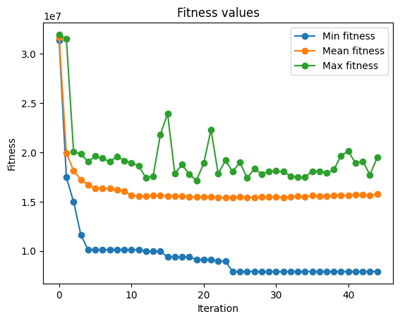
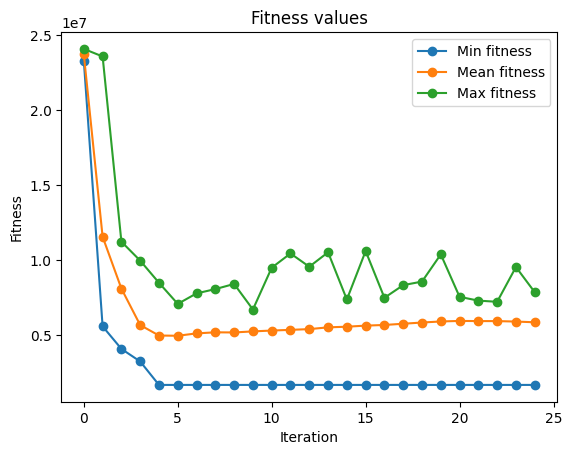
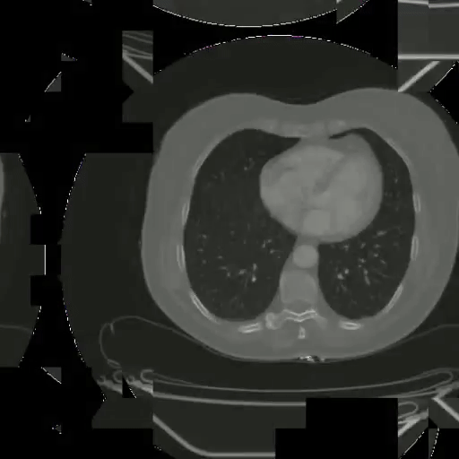
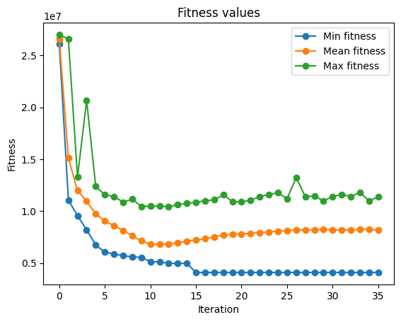
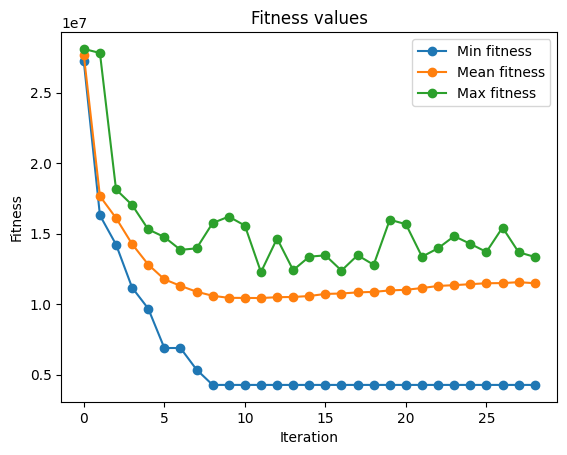
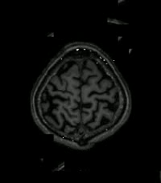
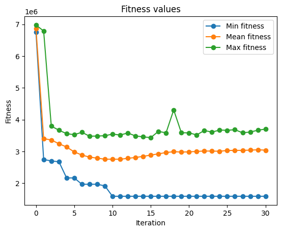

# 3D Jigsaw Solver - Report

## Problem definition

In our project we are using the genetic algorithm methods for solving the jigsaw puzzles.
In the [paper](https://arxiv.org/pdf/1711.06767.pdf) paper the method was shown for solving the 2D puzzles.
We are generalizing the solution for the 3D case.

We have $n$ three dimensional puzzle pieces, that are constructed by splitting the input video/3D image.
Goal is to reconstruct the original input by exploring the space of all possible puzzle permutations.

This problem is known to be NP-hard.
We use a genetic algorithm with custom mutation and crossover algorithm.


## Used paper - https://arxiv.org/pdf/1711.06767.pdf

Our implementation is based on a [paper](https://arxiv.org/pdf/1711.06767.pdf) that proposes a solution for 2D puzzles.
We expand on the ideas introduced there.

## Implementation

We take an input - either 3D image, or a video (in that case the time will be considered as third dimension). We split it into the $n$ identically shaped puzzles to form a puzzle of $W \times H \times Z$ shape.
We then follow the genetic algorithm of the form:
* Create an initial population - each invididual has randomly placed puzzle pieces.
* For each generation:
    * Evaluate the cureent population.
    * Pick $N_E$ elites that remain in the population
    * We randomly choose with weights based on fitness two members of population and cross the to create a new member. We repeat that until the population is full.
    * With $\beta$ probability we perform mutation of the new member in a procedure described below.
* Alogrithm returns puzzle solution with the best fitness score.

### Fitness

Lets define the dissimilarity function between two puzzle pieces $x_i$ and $x_j$ ($x_i, x_j$ are of size $W \times H \times Z$). We compare them in the front-back direction, i. e. $x_j$ is the backward piece and $x_i$ is the frontal one.

$$D_Z(x_i, x_j, r) = \sqrt{\sum_{w=1}^W \sum_{h=1}^H \sum_{c=1}^3 (x_i(w, h, Z, c) - x_j(w, h, 1, c))^2}$$

$D_H, D_W$ are dissimilarity functions for the up-down and left-right directions respectively and are defined analogously.

Intuitively, we calculate the difference between adjecent borders of two pieces (in rgb format) that are next to each other.
It is based on a premise, that adjecent pieces in the original puzzle should share similar coloring.

Fitness function of the entire puzzle solution is the sum over dissimilarity measures between all pairing of neighbour pieces in all three directions.

### Crossover

During the crossover operation we maintain a kernel - set of pieces with relative position saved.
We add new pieces to the kernel iteratively by taking the best fit piece for the current configuration in a greedy manner.
The exact position of each piece is set at the final step of the kernel creation, when all puzzle pieces are added into the kernel.
The intuition behind the operation is that when we have a matching pair of pieces, it should be possible to shift the around 'the board'.
We do not want to fix the puzzle piece into a single place, but rather we place the piece based on its position relative to other pieces.

Crossover operator definition:
* Start by adding a random piece into the kernel
* Every time a new puzzle is added, check each of its borders that is not taken (left, right, up, down, forward, backward) and for each of those borders calculate which piece is the best fit for that place using the following steps.
    * If both parents have the the same puzzle adjecent to the piece under consideration and this puzzle is in the available pieces it is used and added to the kernel.
    * If the added puzzle has a best-buddy puzzle in the available piece and it is an adjecent puzzle in at least one of the parents then it is added to the kernel.
    * Puzzle that is the best fitting puzzle from the available pieces is added to the kernel.

Pieces $P_1$ and $P_2$ are best-buddy pieces if for one of $P_1$'s borders $P_2$ has the smallest dissimilarity, and for corresponding border of $P_2$ the best fit is $P_1$.


In the visualization video the bottom two puzzles represent the parents that are picked to create a new offspring.
The upper puzzle is the new offspring.
New pieces are added iteratively.
Green color means that both of the parents agreed on that piece.
Blue color means that best-buddy puzzle was picked.

### Mutation

We introduce two types of mutations:
* In crossover operator when calculating the best-fit puzzle a randomly chosen puzzle from the available pieces is picked and added to the kernel instead with probability $\alpha$.

* After the crossover operator with probability $\beta$ we perform mutation by reversing the order of the puzzle placement in the third dimension (depth). Lets consider layers of puzzle pieces, placed along the third dimension. Two indices are picked $0 \leq i \leq j \leq Z$ and then puzzles layers between the $i$ and $j$ are inversed.
For example if $i = 2$ and $j = 5$ then pieces of depth $2$ swap with pieces of depth $5$ and pieces with depth $3$ swap with pieces of depth $4$.

## Results

We have tested the image on two youtube videos and three 3D images of medical scans.

Each experiment was run wil following parameters:
* Population number: 500
* Number of puzzles: 3375 - $15 \times 15 \times 15$ puzzles in each dimension
* Number of elites: 15
* $\alpha$: 0.003
* $\beta$: 0.05
* Maximum number of generations: 100

Results for each image:

### Video no. 1



To run this example use:
```
python3 main.py --video-path example/example.mp4
```

### Video no. 2



To run this example use:
```
python3 main.py --video-path example/example2.mp4
```

### 3D Image no. 1



To run this example use:
```
python3 main.py --video-path example/scan-1.avi
```

### 3D Image no. 2



To run this example use:
```
python3 main.py --video-path example/scan-2.avi
```

### 3D Image no. 3



To run this example use:
```
python3 main.py --video-path example/brain_scan.nii.gz --input-type image
```

### Ablation study

As we can see from the results, the presented algorithm finds the best solution in a matter of couple of generations.
Most notably, the crossover operation as it is defined right now is quite powerful, findind ... . We have performed the ablation study to analyze the power of this operation.

At first we analyzed less sophisticated crossover operation that instead performs only two steps:
* If both parents have the the same puzzle adjecent to the piece under consideration and this puzzle is in the available pieces it is used and added to the kernel.
* Add add a random piece in that place to the kernel.

The results can be seen here:

Hyperparameters used:
* Population number: 500
* Number of puzzles: 3375 - $15 \times 15 \times 15$ puzzles in each dimension
* Number of elites: 15
* $\alpha$: 0.003
* $\beta$: 0.05
* Maximum number of generations: 100

TODO: Add results

As presented above, this model has not enough power to produce results that are satisfactory.
The other thing that we have checked is whether the evolution mechanism adds anything to the algorithm at all.
We have tried finding a solution for the same inputs, running the algorithm for a single generation, so that we are spanning the crossover across the entire population only once. Results of the experiment are as follows:

Hyperparameters used:
* Population number: 500
* Number of puzzles: 3375 - $15 \times 15 \times 15$ puzzles in each dimension
* Number of elites: 15
* $\alpha$: 0.003
* $\beta$: 0.05
* Maximum number of generations: 100

TODO: Add kot z diagramem dla jednej generacji

TODO: Komentarz co wyszlo z pojedynczej generacji

## Further Work

* As can be seen in the examples provided as the evolution goes on, at some point the mean of population fitness slighty rises. This is an unexpected behaviour, one that would require more thorough investigation.
* We have seen a significant increase in puzzle solution accuracy after introducing $\beta$ parameter and related mutation procedure. One can experiment with such a mutiation to see what would work the best (for example - more general form, considering layers from all dimensions instead of only the depth of the puzzle).
* Create new metrics so that the performance of the model can be measured more accurately.
Those metrics would be used to calculate how good is the final best individual compared to the optimal solution.
* Create new fitness function.
As seen in the examples dissimilarity is not an optimal choice for this problem.
For some puzzles it is possible to find an individual that has better fitness score than the best solution.

## Sources:

[Medical scans](https://wiki.cancerimagingarchive.net/pages/viewpage.action?pageId=52757270&fbclid=IwAR23VNHe9kIEs3i6TyXnXsf71Vs62GgTChq-N9FUHOpu4mACfY6QltU7pZg)

[World's smallest cat 🐈](https://www.youtube.com/watch?v=W86cTIoMv2U)

[Pytania do Jana Pawła II](https://www.youtube.com/watch?v=3oKH38_q_Io)
